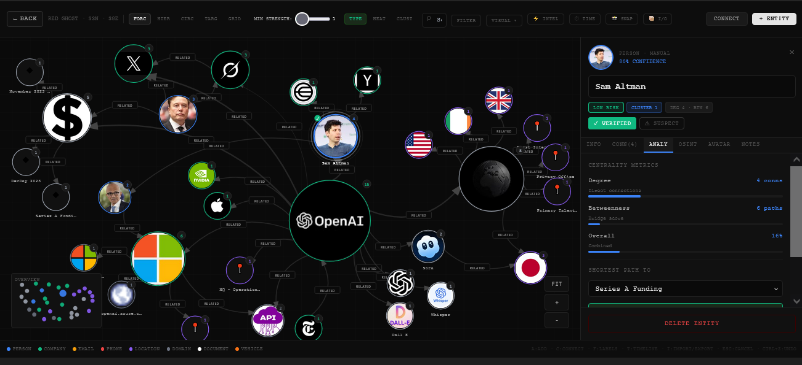
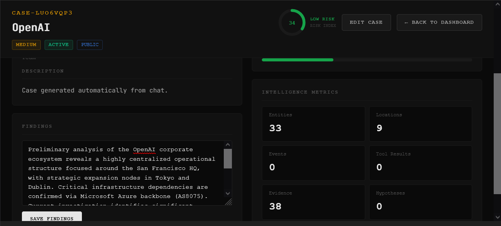
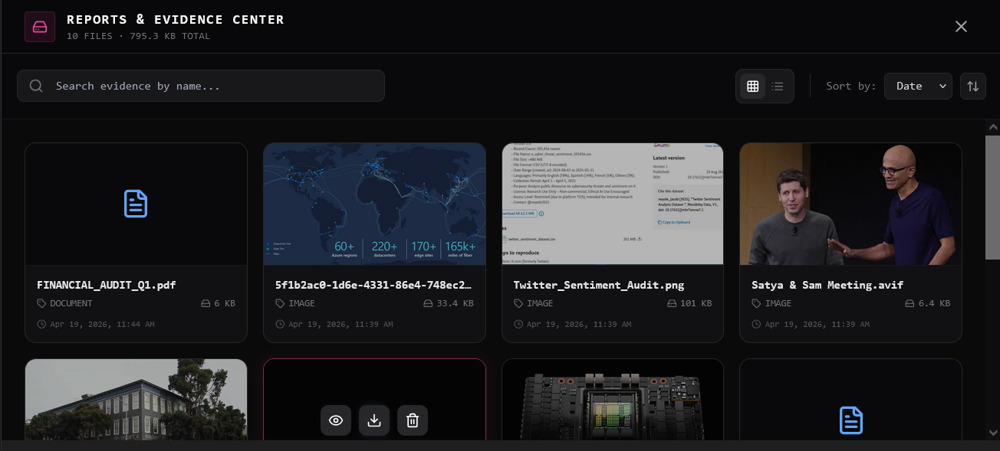
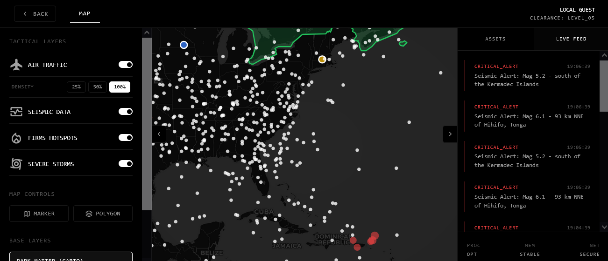
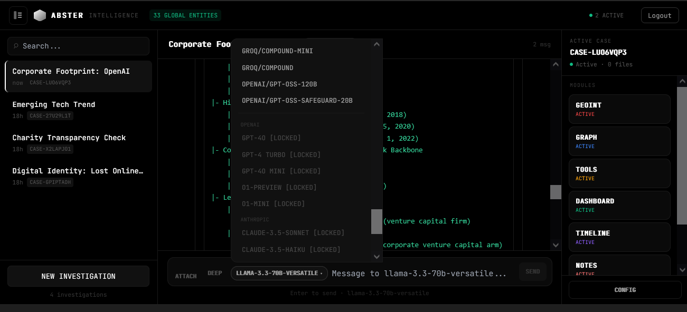
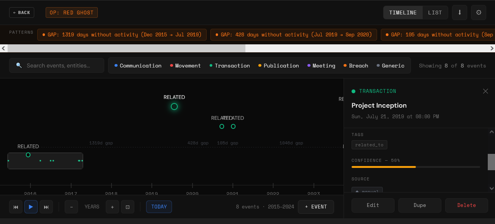
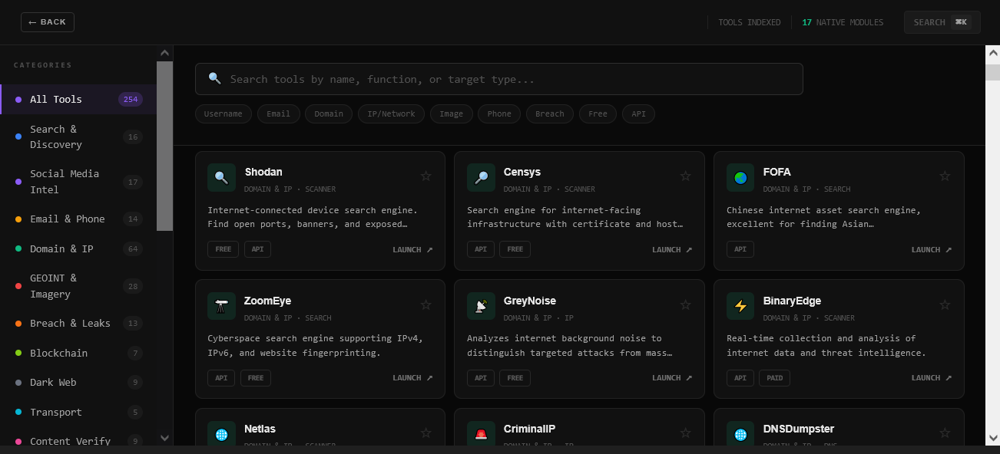
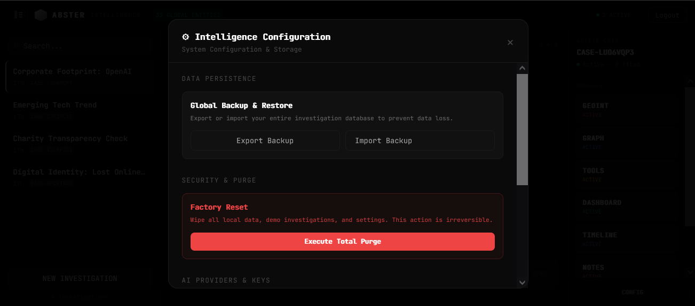

# Abster Intelligence


> Information wants to be free, but intelligence must remain private. 
> **Local-first OSINT workspace for investigators who can’t afford data leakage.**



Abster Intelligence is a privacy-first investigation workspace for OSINT, GEOINT, and cyber research. Map entities in a live relationship graph, build timelines, analyze evidence, and query your case with your own LLM keys—without sending your investigations to a central database.

**Why it stands out:**
- **Local-first by default:** Cases, notes, evidence metadata, and provider settings stay in your browser via IndexedDB.
- **Zero-trust platform model:** Bring your own keys (BYOK). Your keys are not stored by us, and investigation data stays local unless you explicitly query a third-party provider.
- **Graph-native investigations:** Turn fragmented findings into connected entities, locations, and timelines using a dynamic D3.js engine.

---

## Security Model

Abster Intelligence operates under a strict data sovereignty paradigm:
* No Abster-hosted central case database is required or exists.
* Provider keys are configured directly by the user in the UI.
* The platform does not act as a mandatory data relay. When you use an external AI provider, your prompts go directly to them.

## Core Features



* **Local-First Architecture:** Complete data sovereignty. All case work, chat history, and infrastructure evidence are stored safely in your browser using IndexedDB (Dexie.js). No middleman databases, no telemetry.



* **Relational Graph Engine:** Interactive, physics-based network graphs powered by D3.js. Visualize interconnected nodes, geo-entities, and complex infrastructural relationships in real-time.



* **Multi-LLM Integration:** Query your OSINT findings using multiple providers (OpenAI, Anthropic, Gemini, DeepSeek, Local Ollama) simultaneously.



* **Automated Threat Timelines:** Auto-generation of events from investigative reports to track operations chronologically.



* **XSS-Shielded Interface:** Hardened UI with strict DOM sanitization (`isomorphic-dompurify`) ensuring protection against script injections in rendered markdown.



## Security First: BYOK Model



**We do not possess or transmit your API keys.** Abster Intelligence operates on a strict **Bring Your Own Key (BYOK)** model to ensure absolute zero-trust operations.

* No sensitive keys are required or supported in public `.env` files.
* **UI Configuration:** You must configure your provider API credentials directly within the application's Setup/Settings UI.
* Keys are securely persisted in your local browser storage—they never leave your machine.

## Tech Stack

* **Core:** React 19 + Next.js 15 (App Router)
* **Styling:** Tailwind CSS
* **State Management:** Zustand
* **Database:** Dexie.js (IndexedDB wrapper)
* **Visualization:** D3.js

## Project Structure

Here is a high-level overview of the Abster Intelligence codebase architecture. The project follows a modular, feature-based approach within the Next.js App Router paradigm.

```text
abster-intelligence/
├── public/                 # Static assets and public resources
├── src/
│   ├── app/                # Next.js 15 App Router (Pages, Layouts, APIs)
│   ├── components/         # Core React Components
│   │   ├── chat/           # Modular Chat UI (ChatInput, ChatSidebar, ChatMessageList)
│   │   ├── ui/             # Reusable UI / Shadcn Elements
│   │   ├── abster-graph-v4.tsx # D3.js Relational Graph Engine
│   │   ├── abster-chat.tsx # Main Chat Orchestrator (Zustand/Dexie integration)
│   │   └── GeoIntMap.tsx   # Geospatial Intelligence Map Engine
│   ├── lib/                # Utilities (DOMPurify Security, Markdown parsing, Tools)
│   ├── store/              # Zustand global state definitions
│   └── data/               # Dexie.js (IndexedDB) Schema and DB connections
├── package.json            # Project dependencies and operational scripts
├── tailwind.config.ts      # Tailwind CSS configuration and theme
└── next.config.ts          # Next.js compiler and build configuration
```
## Quick Start

Get the OSINT dashboard up and running locally in seconds:

```bash
# Clone the repository
git clone [https://github.com/frangelbarrera/Abster-Intelligence.git](https://github.com/frangelbarrera/Abster-Intelligence.git)
cd Abster-Intelligence

# Install dependencies
npm install

# Start the development server
npm run dev
